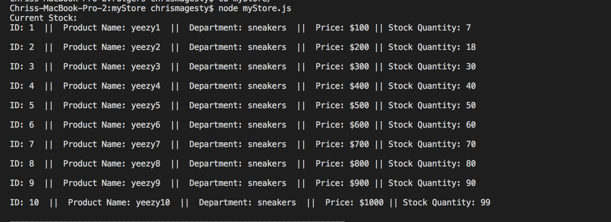

# myStore

<<<<<<< Step One

1) Running this application will first display all of the items available for sale. Including the following:
 ids, names, and prices of products for sale.

=======

>>>>>>> 03b13d1a9f87eef892b7e81ff654809dc4b8b0b2

<<<<<<< Step Two
2) The user is prompted with two questions (found bellow) with the use of inquirer.

---The first ask's user the ID of the product they would like to buy.
---The second message ask's user how many units of the product they would like to buy.

<<<<<<< Step Three

=======

>>>>>>> 03b13d1a9f87eef892b7e81ff654809dc4b8b0b2

3) We check our database to see if our store has enough of the product in our "stock_quantity" to meet the customer's request. If succesful, we console log the order is completed and subtract the quantity purchased from our database.
Once the update goes through, we show the customer the total cost of their purchase.

<<<<<<< Step Four

=======

>>>>>>> 03b13d1a9f87eef892b7e81ff654809dc4b8b0b2

4) If the user types in an id that doesnt exist, user is prevented from completing the order.

<<<<<<< ERROR
=======

>>>>>>> 03b13d1a9f87eef892b7e81ff654809dc4b8b0b2
